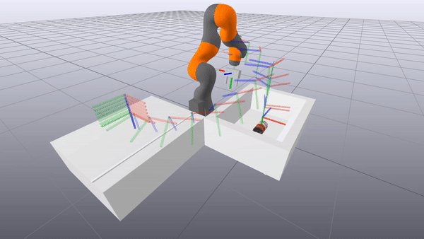

# 6.881 - Robot Manipulation Final Project

## William Chen and Alex Cuellar

This is our code for the final project of 6.881 - Robot Manipulation, taught by Dr. Russ Tedrake 
at MIT in the Fall 2020 semester. The code is divided into several notebooks which are meant to be used on Google Colab.
This code modifies the notebooks presented in the [class's online textbook](http://manipulation.csail.mit.edu/Fall2020/). 

## Contents
1. TO DO: Fill out

## PoseCNN

## Inverse Graphics Pose Refinements

## Upright Placing
`PlaceUpright.ipynb` sets up the simulated 7-degree of freedom robot manipulator in a custom environment containing a bin and a table, with 
a soup can being spawned within the former. The manipulator uses the (estimated or ground-truth) pose of the soup can to pick it up
and place it on the table. 

The arm's trajectory is interpolated from a series of key poses, using quaternion spherical linear interpolation
for the orientation and first-order hold for translation. A non-linear optimizer handles the inverse kinematics, computing the necessary
robot joint angle commands needed to move the gripper along the interpolated trajectory. The optimization provides some slack to degrees of freedom
that do not need to be precisely constrained for the given manipulation task. Combined with the interpolation function using the soup can's
pose to generate a keyframe, this allows the robot to grasp the soup can in a variety of poses.

## References
* [ ] Include references for PoseCNN (https://arxiv.org/abs/1711.00199)
* [ ] Include references for Inverse Graphics
