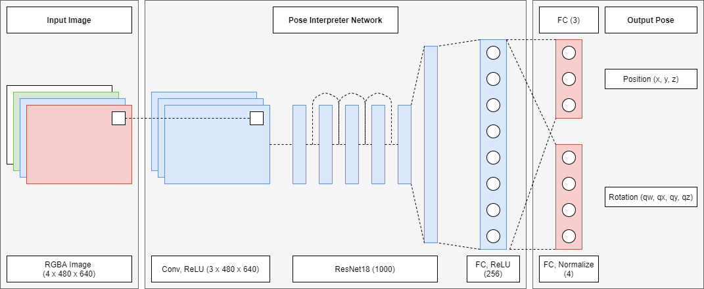
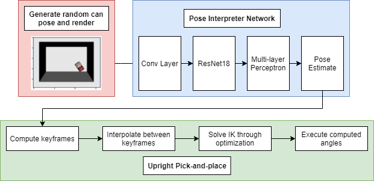

# 6.881 - Robot Manipulation Final Project: Deep Pose Estimation, Path Planning, and Inverse Kinematics for Visual Upright Pick-and-place of the YCB Soup Can

## William Chen and Alex Cuellar

This is our code for the final project of 6.881 - Robot Manipulation, taught by Dr. Russ Tedrake 
at MIT in the Fall 2020 semester. The code is divided into several notebooks which are meant to be used on Google Colab.
This code modifies the notebooks presented in the [class's online textbook](http://manipulation.csail.mit.edu/Fall2020/). 

## Contents
1. [Data Generation](#data-generation)
0. [Mask R-CNN and ICP](#mask-r-cnn-and-icp)
0. [Pose Interpreter Network](#pose-interpreter-network)
0. [Upright Placing](#upright-placing)
0. [Integration Pipeline](#integration-pipeline)

## Data Generation
The synthetic data generation code in `DataGeneration.ipynb` makes use of the Drake simulation environment to create a virtual bin, wherein a soup can from the YCB dataset is spawned in a random pose and the simulator advances one second. Drake's renderer capabilities then allow for an image to be taken of the bin, returning an RGBA/D image or object segmentation mask. Similarly, the ground truth pose of the can is saved as a 7-element vector (cartesian position and quaternion rotation). This allows for the easy generation of labelled training and validation data, used in the neural networks below.

## Mask R-CNN and ICP

## Pose Interpreter Network
The pose interpreter network in `PoseInterpreterNetwork.ipynb` is based off of the architecture in [\[Wu, et al., 2018\]](https://arxiv.org/abs/1808.01099). It extends the ResNet18 architecture with a branching multilayer perceptron to estimate the 6-degree of freedom pose of an observed object of interest (in this case, the YCB dataset's soup can) -- i.e. cartesian position and quaternion orientation. It was trained using the second loss presented in \[Wu, et al., 2018\]. The full architecture is presented below.

## Upright Placing
`PlaceUpright.ipynb` sets up the simulated 7-degree of freedom robot manipulator in a custom environment containing a bin and a table, with 
a soup can being spawned within the former. The manipulator uses the (estimated or ground-truth) pose of the soup can to pick it up
and place it on the table. 

The arm's trajectory is interpolated from a series of key poses, using quaternion spherical linear interpolation
for the orientation and first-order hold for translation. A non-linear optimizer handles the inverse kinematics, computing the necessary
robot joint angle commands needed to move the gripper along the interpolated trajectory. The optimization provides some slack to degrees of freedom
that do not need to be precisely constrained for the given manipulation task. Combined with the interpolation function using the soup can's
pose to generate a keyframe, this allows the robot to grasp the soup can in a variety of poses.

## Integration Pipeline
We integrated our pose estimation methods with the upright pick-and-place system in `Integration.ipynb`. After the can is spawned in the bin, an image is taken of it and fed into one of our pose estimators. This pose estimation is used to compute the grasp pose for the subsequent manipulation task. The entire pipeline thus demonstrates upright pick-and-place with just visual sensor data.

